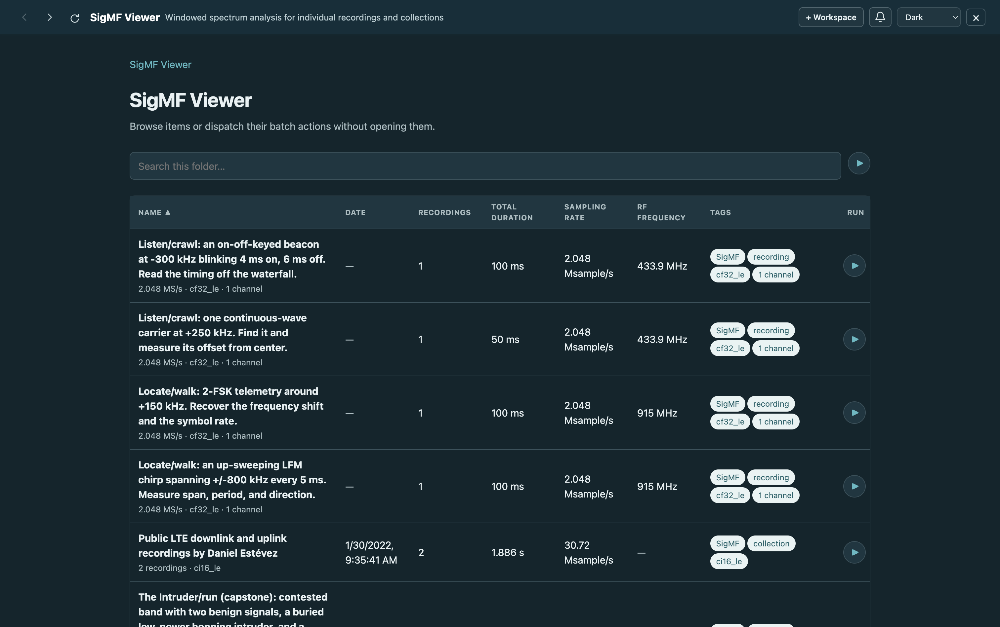
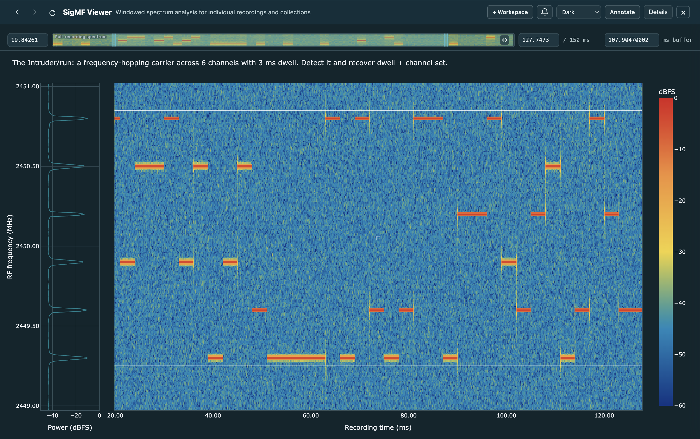
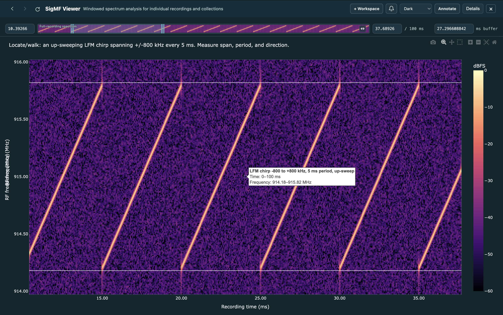
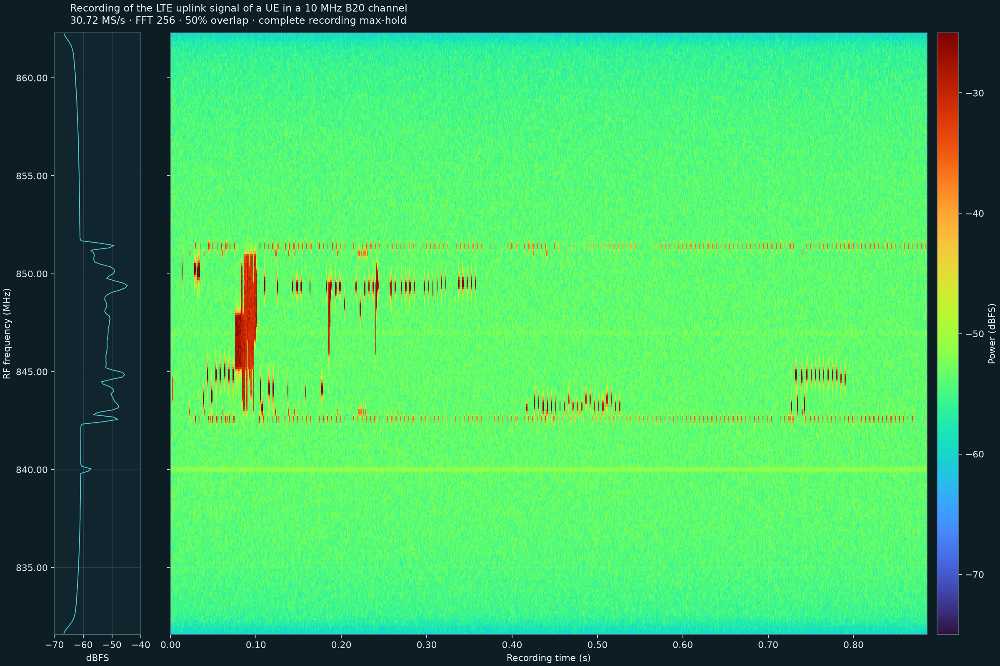

# SigMF Viewer

A focused local browser for SigMF recordings, built as one
[Sigvue](https://github.com/briday1/sigvue) `Workspace`. The application opens
directly onto a flat recording catalog and supports:

- any directory containing `.sigmf-meta`/`.sigmf-data` pairs;
- one pair selected by either its metadata or data path;
- standard `.sigmf-collection` manifests; and
- interleaved multi-channel recordings.

Each standalone pair is one catalog item. A collection is also one catalog
item: its member recordings are selected from a dropdown after it is opened.
Collection members are not duplicated as standalone rows. Discovery validates
every candidate independently, so a missing payload, malformed metadata file,
or broken collection is omitted without hiding the remaining usable data.



## Feature tour

### Spectrum context and responsive scrubbing

The optional average spectrum sits to the left of the waterfall and shares its
RF-frequency axis. It makes persistent carriers and occupied bands easy to
identify without taking vertical space away from recording time.

Progressive rasterization keeps large recordings responsive while scrubbing
and zooming. The viewer renders only the time/frequency region currently being
shown, bounded to the available display resolution, and rerasterizes after
each viewport change. Every grouped display cell is the arithmetic mean of
linear power, converted to dBFS only after averaging. This changes only the
displayed heatmap cells: source samples, STFT values, axes, annotations, and
batch output retain their full accuracy.



### Colormaps and annotations

The Details panel includes a visual picker with ten colormaps, and applies the
chosen colors and fixed dBFS limits consistently to both the main waterfall
and the compact full-recording scrubber. Standard SigMF annotations remain
aligned through window changes and rasterization, with hover details available
directly on the waterfall.



### Durable batch output

Batch mode renders two complementary results for an entire recording without
starting the interactive server:

- a fixed 2400×1600 PNG for sharing, with the complete recording, the average
  spectrum on the left, and a dBFS colorbar; and
- a tiled HTML viewer for exact inspection of recordings that fit the
  configured native-cell limit.

Every STFT frame contributes to the PNG. When the recording contains more
time frames than PNG columns, each displayed cell is the arithmetic mean of
linear power across its contributing frames, converted back to dBFS only for
coloring. The HTML uses that same mean-power rule at every grouped tile level.
It progressively selects finer tiles until every STFT frame and FFT bin maps
to an exact native pixel. Dragging or a two-finger horizontal touchpad gesture
scrubs through time; Shift+scroll provides the same pan on a conventional
wheel. Its **Full PNG** control switches to the matching shareable image.
Sigvue's results browser lists both representations and previews the PNG
directly.

The color scale is discovered independently for each recording with the same
robust percentile and 5 dB rounding rule used by the interactive waterfall.



Actions can run for one catalog row or the whole workspace; collections expand
across every member and channel. Rendering is chunked and writes the PNG, HTML
entry point, and bounded HTML tiles under `outputs/`, allowing Sigvue to
recognize completed work after a restart.

The persistent **Browse** menu opens either **All batch results** or the
full-recording render collection for the selected row or workspace, rather
than only the most recent job. Job notifications continue to link to the exact
run that produced them.

```text
src/sigmf_viewer/
├── sigmf.py       format validation, collections, and exact ranged sample I/O
├── reader.py      fault-tolerant flat discovery and window selection
├── models.py      recordings, collections, windows, and analysis values
├── analysis.py    framework-independent STFT and average PSD
├── plots.py       pure Plotly waterfall figure construction
├── view.py        controls, statistics, tabs, and layout
├── annotations.py standard SigMF annotation discovery and persistence
├── batch.py       shareable PNG and tiled whole-recording outputs
├── workspace.py   one reader + one view callback + one workspace
├── cli.py         application-specific browser command
└── runtime.py     durable data/output roots and generated profiles

scripts/
└── download_data.py   repository-only example-data downloader
```

## Install and download

Install the viewer and Sigvue's shared desktop host, then download the example
recordings:

```bash
python -m pip install -e .
python -m pip install "sigvue[desktop]"
python scripts/download_data.py
```

The repository-only download script retrieves:

- a real 806 MHz LTE downlink and 847 MHz LTE uplink recorded by Daniel
  Estévez, grouped into one standard collection;
- six compact synthetic spectrum-monitoring scenes from Operation Coldferry:
  CW, OOK, FSK, LFM, FHSS, and a contested-band scene; and
- the compact two-channel official SigMF logo recording.

All remote files have fixed sizes and SHA-256 digests. Existing metadata is
preserved so locally added annotations are not overwritten. Choose smaller
groups without downloading the roughly 221 MiB LTE collection:

```bash
python scripts/download_data.py --datasets coldferry sigmf-logo
python scripts/download_data.py --datasets lte
```

The downloader is test/development tooling. It is intentionally absent from
the installed package, wheel, and console entry points.

## Run

Open the repository profile in Sigvue's native desktop host:

```bash
sigvue-desktop --config browser.toml
```

The shared host provides the same Sigvue interface in a pywebview window,
including native fullscreen and folder selection. This workspace package only
defines SigMF discovery, buffering, views, annotations, and batch actions.

To use an ordinary browser instead:

```bash
sigmf-viewer
```

Open <http://127.0.0.1:8000>. With all example data present, discovery shows
eight flat items: one two-recording LTE collection and seven compact
standalone recordings.

Point the application at another directory, pair, or collection:

```bash
sigmf-viewer --data-root /path/to/sigmf
sigmf-viewer --recording /path/to/capture.sigmf-meta
sigmf-viewer --recording /path/to/capture.sigmf-data
sigmf-viewer --recording /path/to/campaign.sigmf-collection
```

An explicit browser profile remains supported:

```bash
sigmf-viewer --config browser.toml
```

The reader supports standard real and complex signed, unsigned, and
floating-point 8/16/32/64-bit datatypes in their defined endianness, plus the
deployed `sc16_le` alias. Integer samples are normalized to full scale before
dBFS analysis. Float64 and wide-integer inputs retain complex128 precision.
Reads are exact, ranged, and channel-aware.

## Interactive view

The viewer uses continuous window mode rather than segmented playback.
Opening an item provides:

- a collection recording dropdown when applicable;
- a low-resolution full-recording spectrum, plus a draggable exact sample
  window and full-extent icon;
- a metadata-labeled channel view switcher for multi-channel recordings, with
  honest zero-based “unlabeled” fallbacks and no redundant channel UI for
  single-channel data;
- explicit fast-time FFT size (256 samples by default) and slow-time overlap
  controls;
- a visual picker with ten colormaps;
- fixed user-controlled waterfall and average-PSD dBFS ranges;
- a compact average PSD occupying the left 10% of the plot width and sharing
  the waterfall's vertical frequency axis;
- independent switches for the average PSD and progressive raster rendering;
- viewport-aware heatmap rendering for the currently visible time/frequency
  bounds after every zoom;
- stable zoom limits when the window, FFT size, or style controls change;
- a quiet heatmap grid and two-decimal time/frequency axes; and
- hoverable standard SigMF annotations with box selection plus color, weight,
  opacity, and visibility controls.

Viewport rasterization changes display cells only. It does not alter samples,
STFT values, annotation coordinates, or the headless pipeline. Plotly Home
and double-click reset always restore the complete current buffer.
Slow-time cells have equal width over the exact selected buffer. Boundary FFTs
are centered, padded only outside the buffer, and normalized by the taper
support that contains real samples, so the first and last heatmap cells are
neither stretched nor artificially attenuated.

Both the main waterfall and its compact timeline spectrum place recording
time left-to-right and frequency bottom-to-top. The timeline covers the
complete source: every sample is read once into non-overlapping time bins,
FFT power is combined in linear units, and only the small frequency-by-time
result is sent to the browser.
`overview_bins`, `overview_frequency_bins`, and `overview_fft_size` in the
workspace configuration control that summary without changing the 30 px bar.

## Batch rendering

Each catalog row has a **Render full-recording PNG and tiled viewer** action.
A standalone recording produces one PNG and, where practical, one HTML viewer
per channel. A collection action renders every member and every channel. The
workspace action renders all catalog items. Deterministic results live under
`outputs/`, so completed outputs are recognized after restart and can be
regenerated explicitly.

The PNG is always produced. Its complete-duration heatmap and left-side
average spectrum use fixed dimensions controlled by `batch_png_time_bins`,
`batch_png_width_pixels`, and `batch_png_height_pixels`. The tiled HTML omits
the spectrum strip to devote its full canvas to exact waterfall inspection.
Both PNG time bins and coarser HTML levels use the arithmetic mean of linear
power for every grouped STFT cell, then convert that mean back to dBFS for
coloring. Maximum zoom loads the native, unaggregated STFT cells.
`batch_colormap` controls both representations.
`batch_max_native_cells` prevents an accidental multi-gigabyte render
(75 million by default). The included LTE captures fit under that bound.
A minute at tens of MS/s does not: materializing every STFT cell into one
portable tile set would contain billions of cells. Such a recording still
gets its complete-duration PNG; use the interactive windowed viewer for exact
inspection. It keeps the full recording available, computes the exact source
data for the visible interval, and rerenders at native resolution as you zoom.
Set the batch limit to `0` only when an unbounded portable HTML export is
deliberate. The dBFS range is always discovered per recording.

Batch actions also run without starting the server:

```bash
sigmf-viewer batch --list
sigmf-viewer batch \
  --workspace sigmf-viewer \
  --item 'lte::public-lte.sigmf-collection' \
  --action render-high-resolution-waterfall
```

Use the identifiers printed by `batch --list`.

## Use the pipeline without the UI

The same format reader, exact window operation, analysis, and plotting
functions work in an ordinary script:

```python
from sigmf_viewer import (
    WaterfallSettings,
    analyze,
    open_recording,
    plot_waterfall,
    read_window,
)

recording = open_recording("capture.sigmf-meta")
window = read_window(recording, start_sample=0, sample_count=262_144)
products = analyze(
    window,
    WaterfallSettings(fft_size=256, overlap_percent=50, channel=0),
)
plot_waterfall(products).show()
```

The reusable reader also exposes the exact browser buffering policy:

```python
from sigmf_viewer import create_reader

reader = create_reader(
    {
        "data_root": "data",
        "default_window_seconds": 0.012,
        "minimum_window_seconds": 0.004,
        "window_step_seconds": 0.002,
        "overview_bins": 300,
    }
)
reference = reader.discover()[0]
source = reader.open(reference)
window = reader.read(source, start=0.0, stop=0.012)
```

For a collection, pass the member's manifest-relative metadata path through
the optional `member=` keyword.

## Desktop delivery

Desktop delivery belongs to Sigvue rather than this workspace package.
`sigvue-desktop` loads the normal profile, so the interactive and batch
pipelines remain independently reusable and no SigMF-specific desktop
executable is installed.

## Test and package

```bash
python -m pip install -e ".[test,release]"
python -m pytest -q
python -m build
python -m twine check dist/*
```

The LTE recordings come from Daniel Estévez's
[public LTE directory](http://nas.destevez.net/~daniel/LTE/). The compact
training scenes come from the MIT-licensed
[Operation Coldferry](https://github.com/soniccidr/Operation-Coldferry)
repository. The logo recording comes from the official
[SigMF repository](https://github.com/sigmf/SigMF). The data remains outside
Git and retains its source metadata and licensing.
